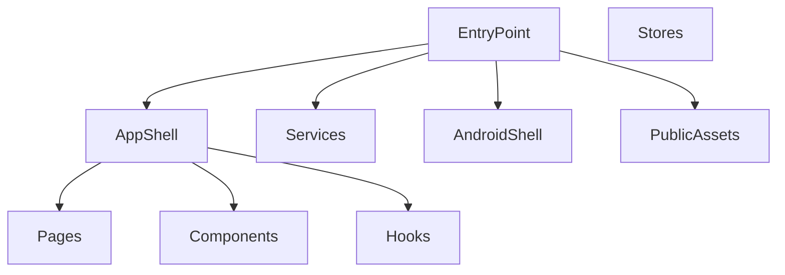

## 1. Stack
- TypeScript + React 19, built with Vite 6 (Unlimitade Storage/package.json)
- Capacitor 7 wraps the web build as a native Android app (@capacitor/android, @capacitor/app, @capacitor/preferences, @capacitor/status-bar, @capacitor/splash-screen)
- Routing: react-router-dom v7; Theming: next-themes; State: zustand; Local DB: sql.js
- UI: Tailwind CSS v4, class-variance-authority, clsx, lucide-react icons, sonner toasts

## 2. Directory map
| Path | What lives there |
|---|---|
| Unlimitade Storage/ | The single subproject in this repo (Capacitor + React + Vite mobile app) |
| Unlimitade Storage/android/ | Native Android shell generated/managed by Capacitor (Gradle project) |
| Unlimitade Storage/public/ | Static assets: logo.png/svg, sql.js wasm binaries |
| Unlimitade Storage/src/ | App source root (imported via `@/` alias, seen in main.tsx/App.tsx) |
| Unlimitade Storage/src/pages/ | Routed views: SetupPage, DrivePage, FolderPage, PhotosPage, FavoritesPage, SearchPage |
| Unlimitade Storage/src/components/ | UI components, incl. layout/ (MobileNav), upload/ (UploadProgress), ui/ (sonner Toaster) |
| Unlimitade Storage/src/hooks/ | Custom hooks, e.g. use-settings (isConfigured, loading) |
| Unlimitade Storage/src/lib/ | Services/utilities, e.g. lib/services/database (initDatabase) |
| Unlimitade Storage/src/stores/ | Zustand state stores (dir observed; contents not read) |
| Unlimitade Storage/src/types/ | TypeScript type definitions (dir observed; contents not read) |

## 3. Diagram

## 4. Component index
- [[EntryPoint]]
- [[AppShell]]
- [[Pages]]
- [[Components]]
- [[Hooks]]
- [[Services]]
- [[Stores]]
- [[AndroidShell]]
- [[PublicAssets]]

## 5. Entry points
- Dev: `npm run dev` (script "dev": "vite") from `Unlimitade Storage/`, serving `Unlimitade Storage/index.html` -> `Unlimitade Storage/src/main.tsx`
- Prod build: `npm run build` (script "build": "tsc && vite build") from `Unlimitade Storage/`
- Prod (Android): `npm run cap:sync` / `cap:open` / `cap:run` (scripts wrap `npx cap sync|open|run android`) against `Unlimitade Storage/android/`

## 6. Conventions
- Path alias `@/` resolves into `src/` (e.g. `@/lib/services/database`, `@/hooks/use-settings`, `@/pages/SetupPage` in main.tsx/App.tsx)
- Page components: PascalCase, `*Page` suffix, one per route (SetupPage, DrivePage, FolderPage, PhotosPage, FavoritesPage, SearchPage — src/App.tsx)
- Non-page component/hook files: kebab-case paths, PascalCase export (e.g. `@/components/layout/mobile-nav` exports `MobileNav`; `@/hooks/use-settings` — src/App.tsx)
- Routing centralized in one `<Routes>` tree inside `src/App.tsx`; unconfigured state force-redirects to `/setup` (src/App.tsx)
- DB initialized before first render: `initDatabase().then(() => ReactDOM.createRoot(...).render(...))` (src/main.tsx)
- Android back-button handling centralized in `src/main.tsx` via `@capacitor/app` `backButton` listener

## 7. Where things go
- New route/page: add file to `Unlimitade Storage/src/pages/`, then import + add `<Route>` in `Unlimitade Storage/src/App.tsx`
- New reusable UI element: add file under `Unlimitade Storage/src/components/<subfolder>/` (mirror existing layout/, upload/, ui/ split)
- New custom hook: add file under `Unlimitade Storage/src/hooks/`, kebab-case filename (see use-settings)
- New DB-backed service: add to `Unlimitade Storage/src/lib/services/`, alongside database (see `@/lib/services/database`)
- Native Android change (permissions, manifest, gradle): edit under `Unlimitade Storage/android/`, then run `npx cap sync android`
